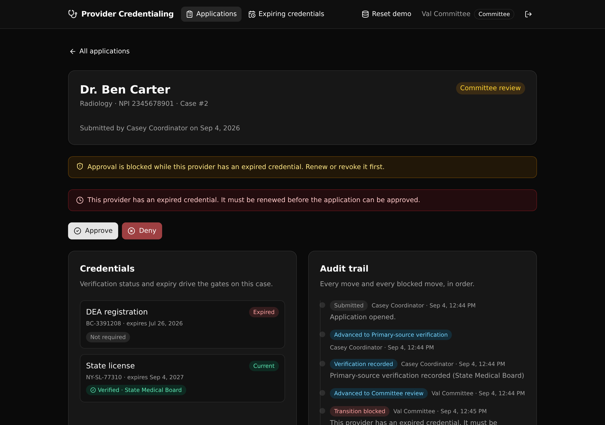

# Provider Credentialing Workflow

A governed Xano backend for healthcare provider credentialing. Each application
moves through an enforced lifecycle, illegal moves and unverified approvals are
blocked at the API layer, expiring credentials are flagged, and every move
(including every blocked move) is written to a readable audit trail.

**Backend Modernization (Play 2), healthcare.** The credentialing rules a legacy
app scatters across a client live in one API layer you can read and trust.

**6 tables · 9 API endpoints · 3 governed rules**



## What it demonstrates

A credentialing case is exactly the kind of workflow a health system holds in a
legacy app today: a state machine, role checks, verification gates, and expiry
rules, all tangled into a client nobody wants to touch. This project rebuilds it
as one Xano backend where those rules are the endpoints.

An evaluator can read every rule in one place and watch it hold:

- **A guarded state machine.** An application moves `submitted` to
  `primary_source_verification` to `committee_review` to `approved` or `denied`,
  and `approved` to `re_credential` back to `primary_source_verification`. Any
  other move is rejected and logged.
- **A verification gate.** A case cannot enter committee review until every
  active credential has a verified primary-source record for that case.
- **An expiry rule.** A credential within 30 days of expiry is flagged, and an
  already-expired credential blocks approval.
- **API-layer RBAC.** A coordinator submits and verifies, a committee advances
  and decides, a viewer reads. Roles are checked in each endpoint with
  `s.precondition`. Access is enforced at the API layer, not with row-level
  security.
- **An append-only audit trail.** Every move and every blocked move writes one
  row, so the case history reads as a governed record.

## Repo layout

```
xano/
  index.ts                 the workspace, registering everything
  tables/                  users, providers, credentials, applications,
                           verifications, credentialing_events
  api/
    groups.ts              the two API groups (pinned canonical slugs)
    auth-login.ts          native token auth (check_password + create_auth_token)
    auth-me.ts
    seed.ts                idempotent demo data
    applications-*.ts      list, get, submit, verify, advance
    credentials-expiring.ts
  xano.lock                pinned object identities (committed on purpose)
frontend/
  src/lib/api.ts           the one contract: paths + types from the query defs
  src/App.tsx              login, applications, expiring view
  src/ApplicationDetail.tsx the case: credentials, actions, audit trail
```

## API surface

Two groups: `api:auth` and `api:credentialing`.

| Method | Path | What it enforces |
| --- | --- | --- |
| POST | `/api:auth/login` | Verifies the password, mints a bearer token. |
| GET | `/api:auth/me` | The current caller and their role. |
| POST | `/api:credentialing/seed` | Idempotent demo data. Public, so the demo can be reset. |
| GET | `/api:credentialing/applications` | Every case with its provider. Any signed-in role. |
| GET | `/api:credentialing/applications/{id}` | One case with credentials, verifications, and the full audit trail. |
| POST | `/api:credentialing/applications/submit` | Coordinator opens a case. |
| POST | `/api:credentialing/applications/{id}/verify` | Coordinator records a primary-source verification. |
| POST | `/api:credentialing/applications/{id}/advance` | The governed core: state machine, verification gate, expiry rule, role guard. Logs the move or the block. |
| GET | `/api:credentialing/credentials/expiring` | Credentials expiring within 30 days or already past. |

## Quick start

You need a Xano account and Node 20 or newer.

```bash
git clone https://github.com/xano-scratch/provider-credentialing-workflow.git
cd provider-credentialing-workflow
npm install
npx xanots login          # one-time browser auth with Xano
npm run xano:deploy       # builds the frontend, deploys to a live ephemeral, prints the URL
```

Then open the printed frontend URL, click "Load demo data", and sign in as one
of the seeded roles (all use the password `password123`):

- `coordinator@example.com`
- `committee@example.com`
- `viewer@example.com`

The `#/demo` route opens the case whose approval the expiry rule blocks, so you
land straight on the governed result.

## Try the rules

- Sign in as **viewer** and open a case. There are no action buttons, and the
  API answers 403 if you call an action anyway.
- Sign in as **committee**, open the case in committee review whose provider has
  an expired credential, and press Approve. The move is blocked and the reason is
  written to the audit trail.
- Sign in as **committee** and try to advance a case that still has unverified
  credentials. The verification gate blocks it.
- Sign in as **coordinator**, verify the credentials, then hand off to committee.
  The same move now succeeds.

## FAQ

**Where does the business logic live?** In the endpoints under `xano/api/`. The
`advance` endpoint holds the state machine, the verification gate, and the expiry
rule. The frontend only calls the API and renders what comes back.

**How does the frontend stay in sync with the backend?** `frontend/src/lib/api.ts`
derives every path and every request and response type from the query defs
(`getPath()`, `InferInput`, `InferResponse`). Change a table or an endpoint and
the frontend fails to compile until it matches.

**Is this row-level security?** No. Xano enforces access at the API layer with
role checks in each endpoint. There is no row-level security anywhere in this
project.

**Is the data real?** No. The seed endpoint creates demo providers and
credentials. The verification "sources" are recorded fields, not live registry
calls. This is a scratch project for evaluation, not a production system.

## License

MIT. See [LICENSE](LICENSE).
